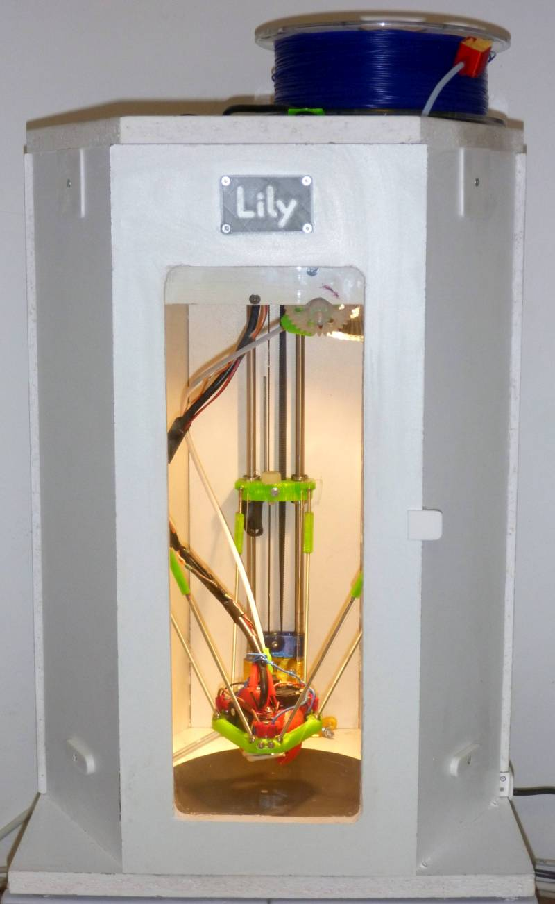

**"Lily" delta printer** built with strong wooden box structure and equipped with activated carbon filters 
The version 'F' is built with RRP Fisher components. Usable area diam 170mm x 242mm or diam 186mm x 225 mm 
To see the simulation of printer, run the "Delta_simulator.scad" in OpenScad  
The parameters of this simulation are defined in "data_Lily_F.scad"  
effector simulation use stl files created in "Effector_Lily_F.scad"  
To creates STL file, define a part Number in "data_Lily_F.scad" in OpenScad  
To creates STL files for the effector, define a part Number in "Effector_Lily_F.scad" in OpenScad  
 

